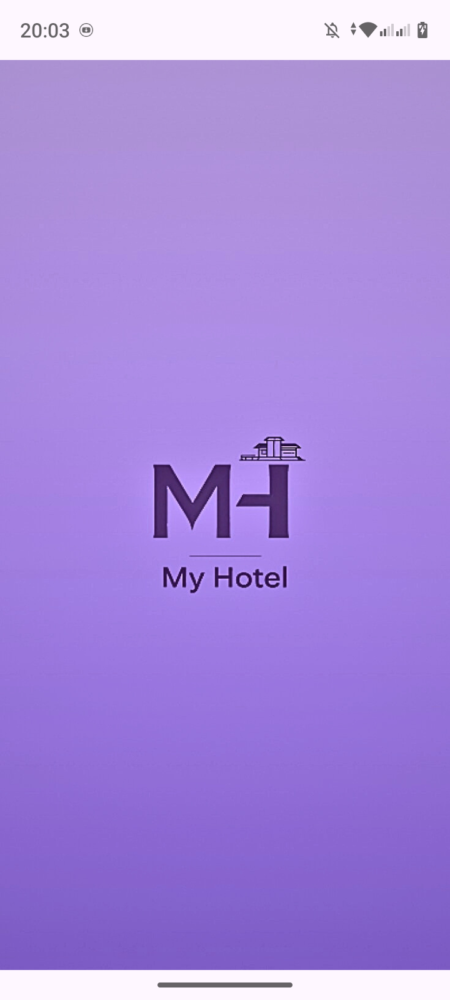
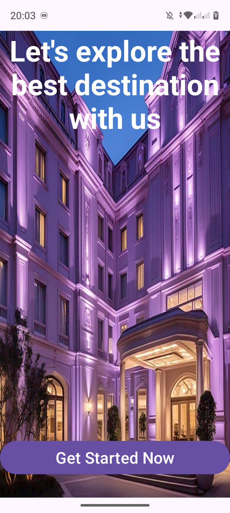
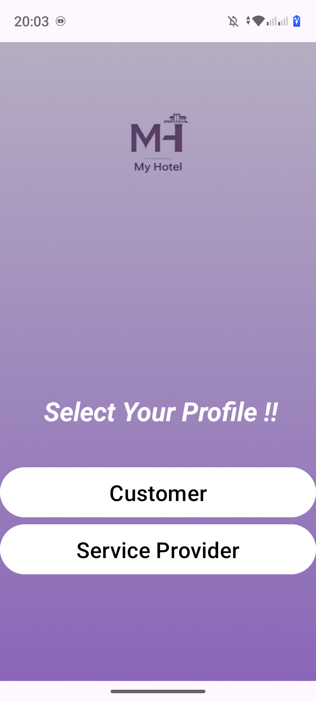
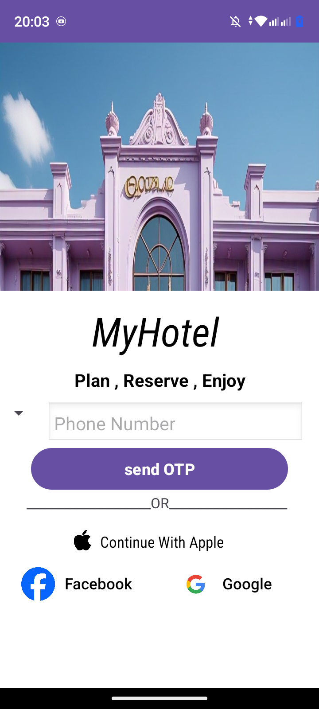
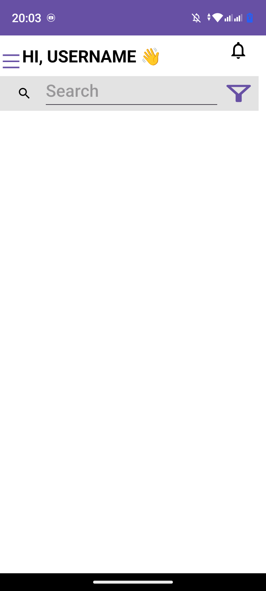
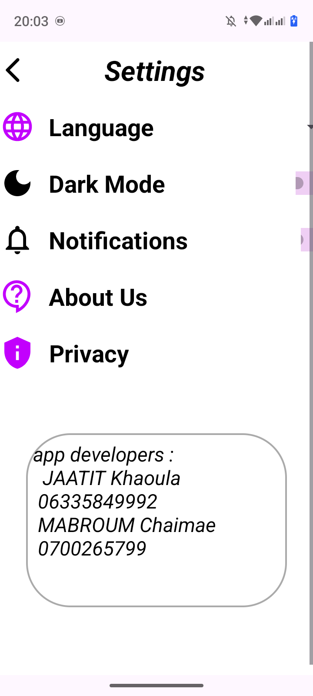
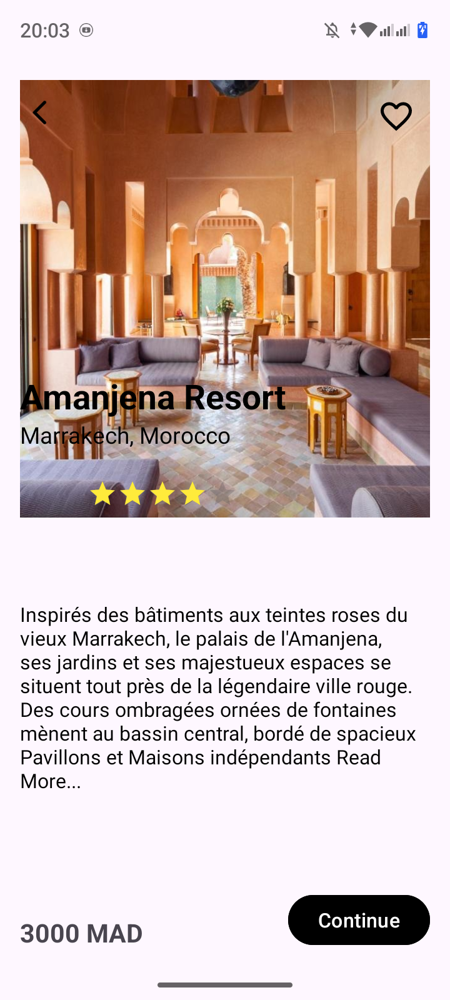

# 🏨 MyHotel: The Gateway to Morocco 🇲🇦

> **Revolutionizing the Moroccan travel ecosystem.** An all-in-one super-app that blends modern convenience with the soul of Moroccan hospitality.

---

## 🌟 The Vision
**MyHotel** isn't just an app; it’s your local companion. While others focus on just the room, we focus on the **journey**. We bridge the gap between global travelers and local communities, ensuring every user lives like a local and discovers the hidden gems of the Maghreb.

---

## 🚀 Super-App Features

| Feature | Description |
| :--- | :--- |
| 🏨 **Stay** | From luxury palaces in Marrakech to cozy Riads in Fes. |
| 🚗 **Move** | Seamless ride-hailing to navigate the busy streets of Casablanca or Rabat. |
| 🛵 **Dash** | Local delivery for your favorite Tajine or essential needs, right to your door. |
| 🌍 **Live** | Exclusive "People-to-People" experiences to discover Morocco's true DNA. |

---

## 📸 App Showcase

  
<i>A glimpse into the user interface and seamless flow.</i>

  
  
  
   
  
  
  
   
  
  
  

---

## 🛠️ The Engine Under the Hood
Designed for speed, security, and scalability.

* **Frontend:**  Kotlin 📱
* **Backend:** Rest API / Firebase 🔥
---
---

Made with ❤️ for Morocco

